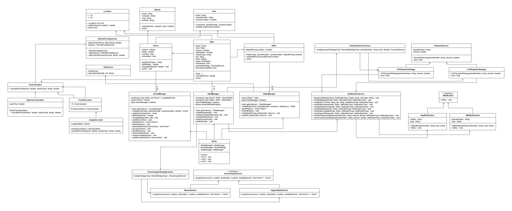
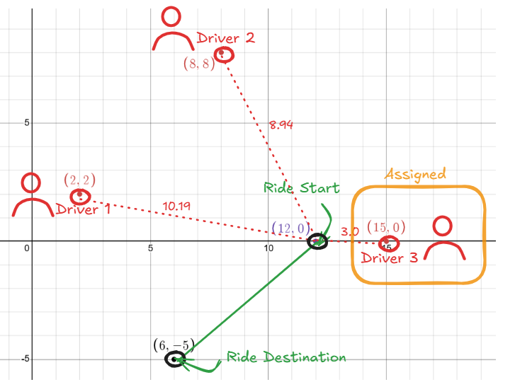
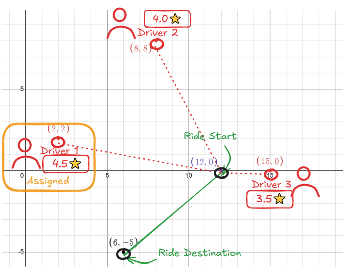
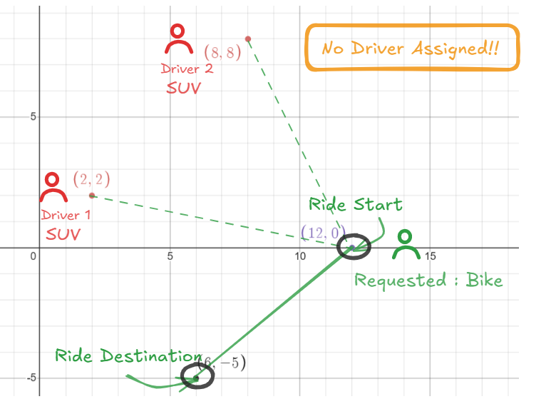

# LLD Hackathon Challenge
## Design a Ride-Sharing Service Platform

[Github Repo for System Design](https://github.com/RahulSahOfficial/LLD)

---
## Name of Application : BrOla🚕
😬 Bro + Ola
### Assumptions
1. The first available driver automatically accepts the ride because simulating ride acceptance or rejection by multiple drivers in real-time is not possible due to fast loop execution.

1. The system does not support carpooling.

>I used a map to store rides in rideManager instead of keeping them inside Rider and Driver to maintain low coupling. This keeps RideManager responsible for ride logic and makes the system more modular and easy to manage.
### Classes Info
**1. `Location`**  
This class stores `x` and `y` coordinates of a point and helps to find `distance` from another point. It also `prints` the location.  
**2. `VehiclePricingService`**  
This class gives `price per km` for different `vehicle types` using `singleton`. Prices are stored in a `map` and returned based on vehicle type.  
**3. `OtpService`**  
This class has a static method to generate a random OTP of given length.  
**4. `FareCalculator`**  
An abstract class with a method to calculate fare based on distance and vehicle type.  
**5. `BaseFareCalculator`**  
Implements fare calculation using a base price plus distance × price per km from VehiclePricingService.  
**6. `PriceDecorator`**  
A wrapper class (decorator) to extend fare calculation logic without changing the original.  
**7. `SurgeDecorator`**  
Extends fare calculator by applying a fixed surge multiplier (1.05) on the final price.  
**8. `INotification`**  
Interface with a notify() method. Any notification class has to implement this.  
**9. `AppNotification`**  
Implements INotification to simulate sending a message to a mobile app.  
**10. `SMSNotification`**  
Implements INotification to simulate sending an SMS to a phone number.  
**11. `NotificationService`**  
Handles different types of notifications (App or SMS). Uses static methods to send ride-related alerts like ride booked, ride started, payment done, etc. Internally uses dispatch() to pick the right notification type.  
**12. `PaymentService`**  
Abstract class for payment. Stores phone number and amount. Has a virtual pay() method.  
**13. `UPIPaymentStrategy`**  
Implements pay() to simulate UPI payment and sends a UPI payment SMS.  
**14. `CODPaymentStrategy`**  
Implements pay() to simulate cash payment and sends a cash payment SMS.  
**15. `PaymentServiceFactory`**  
Creates the correct payment object (UPI or COD) based on strategy type. Uses factory pattern.  
**16. `DriverAssignService`**  
Abstract class to define the assignDriver() method. Different strategies will implement this.  
**17. `NearestDriver`**  
Implements assignment logic to pick the driver closest to the rider's source location.  
**18. `HighestRatedDriver`**  
Implements logic to assign the driver with the highest rating from the available set.  
**19. `DriverAssignStrategyFactory`**  
Creates and returns the right driver assignment strategy (nearest or highest-rated) based on input. Uses factory pattern.  
**20. `User`**  
Base class for Driver and Rider. Stores name, phone, and current location.  
**21. `Rider`**  
Inherits User. Adds a default pickup location and allows updating it.  
**22. `Driver`**  
Inherits User. Holds vehicle info, online/available status, and rating. Can change rating.  
**23. `Vehicle`**  
Stores vehicle details like name, company, type, and number.  
**24. `Ride`**  
Handles ride data rider, driver, locations, OTP, price, payment method, and ride status. Calculates fare and manages peak hour surge.  
**25. `DriverManager`**  
Creates and manages drivers, tracks availability by vehicle type, and handles online/offline status. It follows the Singleton pattern.  
**26. `RideManager`**  
Handles ride booking, driver assignment, ride progress, and payments. Maintains mappings for driver and rider to rides. It follows the Singleton pattern.  
**27. `RiderManager`**  
Creates riders, updates locations, and stores rider data. It follows the Singleton pattern.  
**28. `BrOla`**  
Orchestrates the ride-booking process by connecting RiderManager, DriverManager, and RideManager. Its run methods simulate rides using different driver assignment strategies and payment types.  

---
### UML Diagram
**Class Diagram**  


---
### Happy Flows  
##### Scenerio 1  (Assigning Driver based of Nearest Parameter)  
**Scenerio**  
  
In this scenerio we have three drivers each with suv vehicle currently on different location.  
Driver 1 on `Location(2,2)`   
Driver 2 on `Location(8,8)`   
Driver 3 on `Location(15,0)`   
Rider `Sah` want to travel from `Location(12,0)` to `Location(6,-5)`  
Rider used `NearestStrategy` for Assigning Driver with `CODStrategy` from Payment Strategy and its `not` peakHour  
**Distance between driver and rider**  
Driver 1 : `10.19`  
Driver 2 : `8.94`  
Driver 3 : `3.0`  
**Hence `Driver 3` will be assigned** to rider as he is nearest to the rider.  
**Code**  
```cpp
// Driver Assignment based on Nearest Strategy
// Creating Driver 1 
Vehicle *safari=new Vehicle("Safari","Tata","SUV","JH01AA1234");
Location *driver1Loc=new Location(2,2);
Driver *driver1=driverManager->createDriver("Driver1","9998887777",driver1Loc,safari);

// Creating Driver 2
Vehicle *scorpio=new Vehicle("Scorpio","Mahindra","SUV","JH01BB1234");
Location *driver2Loc=new Location(8,8);
Driver *driver2=driverManager->createDriver("Driver2","9988776655",driver2Loc,scorpio);

// Creating Driver 3
Vehicle *creta=new Vehicle("Creta","Hyundai","SUV","JH01CC1234");
Location *driver3Loc=new Location(15,0);
Driver *driver3=driverManager->createDriver("Driver3","8877665544",driver3Loc,creta);

//Creating Rider 1
Location *riderCurrentLocation=new Location(12,0);
Rider *rider1=riderManager->createRider("Sah","5675765676",riderCurrentLocation,riderCurrentLocation);

// All riders are online now 
driverManager->goOnline(driver1);
driverManager->goOnline(driver2);
driverManager->goOnline(driver3);
driverManager->printAllDrivers();

Location *destination=new Location(6,-5);
rideManager->createRide(rider1,"SUV",riderCurrentLocatiodestination,false,DriverStrategyType::NearesPaymentStrategyType::COD);
// Driver 3 assined as he was nearest 
// Driver 3 comes to riders location
driverManager->updateLocation(driver3,riderCurrentLocation);
// Driver Submits otp and starts the ride 
rideManager->validateAndStartRide(driver3,"1234");
// Driver Reached the destination 
driverManager->updateLocation(driver3,destination);
// Driver Completes the ride 
rideManager->completeRide(driver3);
// Rider makes the payment 
rideManager->makePayment(rider1);
```
**Output**
```
Driver Driver1 created!
Driver Driver2 created!
Driver Driver3 created!
Rider Sah created!
All Drivers :
Driver : 
Name : Driver1
Phone : 9998887777
Rating : 3
Location : (2,2)
Vehicle : 
Name : Safari
Company : Tata
Type : SUV
Number : JH01AA1234

Driver : 
Name : Driver2
Phone : 9988776655
Rating : 3
Location : (8,8)
Vehicle : 
Name : Scorpio
Company : Mahindra
Type : SUV
Number : JH01BB1234

Driver : 
Name : Driver3
Phone : 8877665544
Rating : 3
Location : (15,0)
Vehicle : 
Name : Creta
Company : Hyundai
Type : SUV
Number : JH01CC1234

Notification sent to 📱 : 🔔 Ride Booked!
Notification sent to 📱 : 🔔 Ride OTP : 0350
Driver Assigned : Driver3
Notification sent to 📱 : 🔔 Rider Assigned!
Notification sent to 📱 : 🔔 Ride Started!
Notification sent to 📱 : 🔔 Ride Completed!
SMS sent to 5675765676 : 🔔 Amount 197.394744 paid via CASH
Notification sent to 📱 : 🔔 Payment Done!
```
**Travel Fare : `197.394`** without surge price

##### Scenerio 2  (Assigning Driver based of Driver Rating)  
**Scenerio**  
  
In this scenerio also we have three drivers each with suv vehicle currently with different ratings.  
**Driver ratings**  
Driver 1 rating `4.5`  
Driver 2 rating `4.0`  
Driver 3 rating `3.5` 
Rider `Sah` want to travel from `Location(12,0)` to `Location(6,-5)`   
Rider used `HighestRatedStrategy` for Assigning Driver with `UPIStrategy` from Payment Strategy and its  `peakHour`  
**Hence `Driver 1` will be assigned** to rider as he has the highest rating even though is is far as compared to other riders.  
**Code**
```cpp
// Driver Assignment based on Rating Strategy
// Creating Driver 1 
Vehicle *safari=new Vehicle("Safari","Tata","SUV","JH01AA1234");
Location *driver1Loc=new Location(2,2);
 Driver *driver1=driverManager->createDriver("Driver1","9998887777",driver1Loc,safari);
// Adding extra rating sor simulation 
driverManager->changeRating(driver1,1.5);

// Creating Driver 2
Vehicle *scorpio=new Vehicle("Scorpio","Mahindra","SUV","JH01BB1234");
Location *driver2Loc=new Location(8,8);
Driver *driver2=driverManager->createDriver("Driver2","9988776655",driver2Loc,scorpio);
driverManager->changeRating(driver2,1.0);

// Creating Driver 3
Vehicle *creta=new Vehicle("Creta","Hyundai","SUV","JH01CC1234");
Location *driver3Loc=new Location(15,0);
Driver *driver3=driverManager->createDriver("Driver3","8877665544",driver3Loc,creta);
driverManager->changeRating(driver3,0.5);

//Creating Rider 1
Location *riderCurrentLocation=new Location(12,0);
Rider *rider1=riderManager->createRider("Sah","5675765676",riderCurrentLocation,riderCurrentLocation);
// All riders are online now 
driverManager->goOnline(driver1);
driverManager->goOnline(driver2);
driverManager->goOnline(driver3);
driverManager->printAllDrivers();

Location *destination=new Location(6,-5);
rideManager->createRide(rider1,"SUV",riderCurrentLocation,destination,true,DriverStrategyType::HighestRated,PaymentStrategyType::UPI);
// Driver 1 assined as he has highest rating 

// Driver 1 comes to riders location
driverManager->updateLocation(driver1,riderCurrentLocation);
// Driver Submits otp and starts the ride 
rideManager->validateAndStartRide(driver1,"1234");
// Driver Reached the destination 
driverManager->updateLocation(driver1,destination);
// Driver Completes the ride 
rideManager->completeRide(driver1);
// Rider makes the payment 
rideManager->makePayment(rider1);
```

**Output**
```
Driver Driver1 created!
Driver Driver2 created!
Driver Driver3 created!
Rider Sah created!
All Drivers :
Driver : 
Name : Driver1
Phone : 9998887777
Rating : 4.5
Location : (2,2)
Vehicle : 
Name : Safari
Company : Tata
Type : SUV
Number : JH01AA1234

Driver : 
Name : Driver2
Phone : 9988776655
Rating : 4
Location : (8,8)
Vehicle : 
Name : Scorpio
Company : Mahindra
Type : SUV
Number : JH01BB1234

Driver : 
Name : Driver3
Phone : 8877665544
Rating : 3.5
Location : (15,0)
Vehicle : 
Name : Creta
Company : Hyundai
Type : SUV
Number : JH01CC1234

Notification sent to 📱 : 🔔 Ride Booked!
Notification sent to 📱 : 🔔 Ride OTP : 7066
Driver Assigned : Driver1
Notification sent to 📱 : 🔔 Rider Assigned!
Notification sent to 📱 : 🔔 Ride Started!
Notification sent to 📱 : 🔔 Ride Completed!
SMS sent to 5675765676 : 🔔 Amount 207.264481 paid via UPI
Notification sent to 📱 : 🔔 Payment Done!
```
**Travel Fare : `207.364`** with surge price applied

#####  Scenerio 3  (No Driver Assigned)
**Scenerio**
  
In this scenerio we have two drivers each with suv vehicle.  
Rider `Sah` want to travel from `Location(12,0)` to `Location(6,-5)`  
Rider used `NearestStrategy` for Assigning Driver with `UPIStrategy` from Payment Strategy and its  `peakHour` and vehicle type is `Bike`.  
As there is no driver with Bike as Vehicle.  
**Hence no driver will be assigned.** 

**Code**
```cpp
// Creating Driver 1 
 Vehicle *safari=new Vehicle("Safari","Tata","SUV","JH01AA1234");
Location *driver1Loc=new Location(2,2);
Driver *driver1=driverManager->createDriver("Driver1","9998887777",driver1Loc,safari);

// Creating Driver 2
Vehicle *scorpio=new Vehicle("Scorpio","Mahindra","SUV","JH01BB1234");
Location *driver2Loc=new Location(8,8);
Driver *driver2=driverManager->createDriver("Driver2","9988776655",driver2Loc,scorpio);

//Creating Rider 1
Location *riderCurrentLocation=new Location(12,0);
Rider *rider1=riderManager->createRider("Sah","5675765676",riderCurrentLocation,riderCurrentLocation);

// All riders are online now 
driverManager->goOnline(driver1);
driverManager->goOnline(driver2);
driverManager->printAllDrivers();

Location *destination=new Location(6,-5);
rideManager->createRide(rider1,"BIKE",riderCurrentLocation,destination,true,DriverStrategyType::Nearest,PaymentStrategyType::UPI);      
```
**Output**
```
Driver Driver1 created!
Driver Driver2 created!
Rider Sah created!
All Drivers :
Driver : 
Name : Driver1
Phone : 9998887777
Rating : 3
Location : (2,2)
Vehicle : 
Name : Safari
Company : Tata
Type : SUV
Number : JH01AA1234

Driver : 
Name : Driver2
Phone : 9988776655
Rating : 3
Location : (8,8)
Vehicle : 
Name : Scorpio
Company : Mahindra
Type : SUV
Number : JH01BB1234

Notification sent to 📱 : 🔔 Ride Booked!
Notification sent to 📱 : 🔔 No Riders Found!
```
**Ride cannot be completed as no driver for Bike**

---
